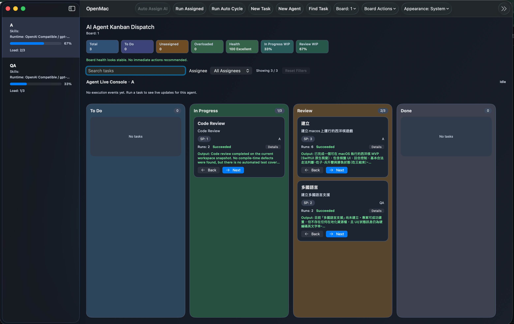
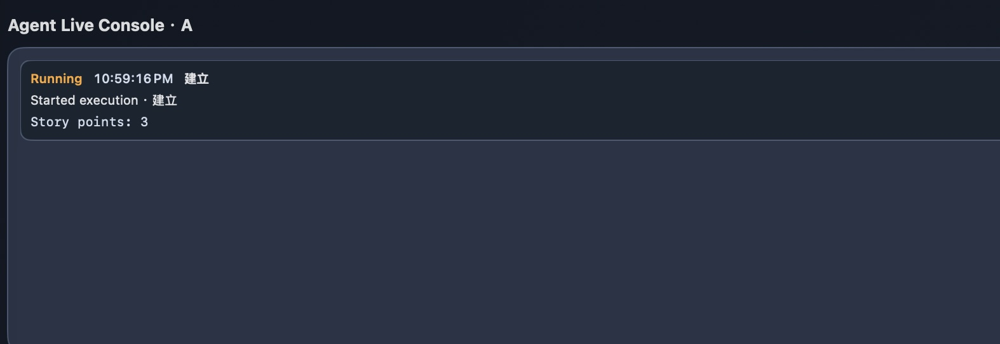

# OpenMac

OpenMac est une application Kanban d'agents IA orientee macOS pour planifier, dispatcher et executer des flux de travail.

## Langues

- [English](README.md)
- [繁體中文](README.zh-Hant.md)
- [简体中文](README.zh-Hans.md)
- Français (actuel)
- [Español](README.es.md)
- [日本語](README.ja.md)
- [한국어](README.ko.md)

## Captures d'ecran

### Tableau Kanban


### Console Live Agent


## Fonctionnalites

- Flux Kanban IA (`To Do`, `In Progress`, `Review`, `Done`)
- Auto-assignation selon les competences et la charge
- Execution en lot des taches assignees (`Run Assigned`)
- Modes runtime : `Local Mock` et `OpenAI Compatible`
- Auth OpenAI compatible : `API Key` ou `Codex Bridge`
- PM Planner :
  - Generation de tickets executables a partir du brief projet
  - Edition des tickets avant creation
  - Modeles rapides (`SaaS Product`, `Desktop App`, `Developer API`)
  - Flux `Create + Run Assigned`
- Console live avec copie de sortie et logs debug
- Recommandations de sante du board, limites WIP, tri manuel
- Import/export workspace JSON
- Interface multilingue (EN/ZH-TW/ZH-CN/FR/ES/JA/KO), repli en anglais sinon

## Stack technique

- Swift
- SwiftUI
- XCTest / Swift Testing
- Projet Xcode (`OpenMac.xcodeproj`)

## Structure du projet

```text
OpenMac/
  Domain/         # modeles, logique de dispatch, moteur de planification
  ViewModels/     # orchestration du board et integration runtime
  Views/          # composants SwiftUI reutilisables
  Localization/   # reglages et resolution de langue
  *.lproj/        # chaines localisees
OpenMacTests/     # tests unitaires / logique
OpenMacUITests/   # tests UI
```

## Demarrage rapide

1. Clonez ce depot.
2. Ouvrez `OpenMac.xcodeproj` dans Xcode.
3. Selectionnez le scheme `OpenMac`.
4. Lancez sur `My Mac`.

## Configuration AI Runtime

### Option A : API Key

- Definir `OPENAI_API_KEY` (ou `OPENAI_COMPAT_API_KEY`) dans l'environnement.
- Optionnel : definir `OPENAI_BASE_URL` pour un endpoint OpenAI-compatible.

### Option B : Codex Bridge

1. Installer Codex CLI ou l'app Codex.
2. Executer `codex login` dans Terminal.
3. Dans l'app, choisir `OpenAI Compatible` + `Codex Bridge`.

## Tests (TDD-friendly)

Executer tous les tests :

```bash
xcodebuild test -scheme OpenMac -destination 'platform=macOS'
```

Executer un target de test specifique :

```bash
xcodebuild test -scheme OpenMac -destination 'platform=macOS' -only-testing:OpenMacTests
```

