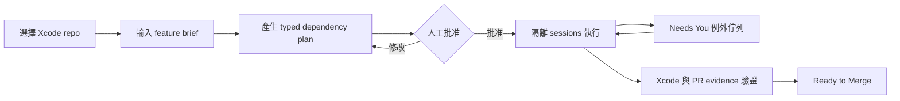

# OpenMac v2 產品規格

> 狀態：Draft for validation
> 更新日期：2026-07-31
> 決策：建立 Apple/Xcode 的 spec-to-verified-PR 交付層；不做 AO clone

## 1. 產品摘要

OpenMac v2 是 macOS 上面向 Apple 開發者的 **spec-to-verified-PR delivery control plane**。

它把一份 feature brief 轉成可審核、具 typed dependencies、風險與驗收條件的執行計畫；使用者批准後，OpenMac 將可執行項目交給隔離的 coding-agent sessions，並根據真實 runtime、Git、Xcode 與 PR facts 顯示進度。只有在 agent 卡住、驗證失敗或 PR 可合併時，才要求人介入。

一句話價值主張：

> 從一份需求，安全地啟動多個 coding agents，最後得到有 Xcode 與 PR 證據、可審核的變更，而不是一排自稱完成的任務。

AO 是第一個可選的 execution backend。OpenMac 不 fork、不內嵌，也不重做 AO 的 daemon、terminal、worktree 或 session lifecycle；backend 可以被替換，產品價值不能依賴某一個 backend 才成立。

## 2. 要解決的問題

目前的 coding agents 已能寫程式、建立 worktree、執行測試與處理 PR，但同時跑多個 sessions 時，使用者仍需自行完成四件事：

1. 把模糊需求拆成可平行且不互踩的工作。
2. 在執行前確認範圍、依賴、風險與完成條件。
3. 持續追蹤哪個 session 卡住、失敗或偏離需求。
4. 從 build、test、diff、CI 與 review facts 判斷是否真的完成。

OpenMac v1 把這個問題呈現成 Kanban、AgentProfile 與 PM 管理問題；v2 的假設是，使用者真正購買的是「更少的監工時間」與「更可信的交付結果」。

## 3. 目標使用者

主要 persona 是使用 macOS 的 solo developer 或 2–5 人 Apple 開發團隊，且：

- 維護 iOS、macOS、watchOS、tvOS 或 Swift package 專案。
- 已使用 Codex、Claude Code 或其他 terminal coding agents。
- 每週至少會同時執行三個 coding sessions。
- 使用 Git 與 pull request 作為主要交付流程。
- 願意在 dispatch 前批准計畫，也要求完成後有可驗證證據。

不優先服務：

- 只偶爾執行單一 prompt 的一般使用者。
- 只需要傳統 Kanban、工時或專案報表的團隊。
- 不使用 Git／PR 的流程。
- 需要雲端多人協作、RBAC、集中式 fleet 或合規稽核的大型組織。

## 4. Jobs To Be Done

當我要交付一個跨多檔案或多模組的 Apple 平台功能時，我希望：

1. 在數分鐘內得到可編輯的工作拆解與依賴順序。
2. 在 agent 改動程式前，一次確認範圍、風險與驗收條件。
3. 將可平行的工作安全地交給隔離 sessions。
4. 只在 session 卡住、結果不符規格或 PR 可合併時介入。
5. 根據 `xcodebuild`、tests、diff、screenshots、CI 或 review facts 判斷完成，而不是相信 agent 的文字聲明。

## 5. 核心工作流



### 5.1 選擇專案與輸入需求

- 使用者選擇一個含 `.xcodeproj`、`.xcworkspace` 或 `Package.swift` 的 Git repository。
- 輸入 feature brief；GitHub issue 匯入可以延後，不是第一條路徑的必要條件。
- OpenMac 在任何執行前顯示 repo、base branch 與預計使用的 backend。

### 5.2 產生並審核計畫

OpenMac 產生 3–7 個 `DeliveryTask`。每個 task 必須包含：

- title 與 worker prompt；
- acceptance criteria；
- typed dependency IDs；
- risk level；
- required evidence；
- 可能影響的 target／scheme 或模組；
- 是否需要額外的人工作業。

批准前可以新增、刪除、重排或修改 task。循環依賴、無法解析的 dependency、空白 acceptance criteria 或零 evidence requirement 都會阻止批准。

### 5.3 Dispatch 與隔離執行

- 未批准的 plan 不得產生任何外部 session 或修改 repository。
- 只 dispatch dependencies 已滿足的 tasks。
- 每次嘗試保存 `plan task ID → backend session ID → attempt` 映射。
- execution backend 負責 session、process、worktree 與 branch lifecycle。
- 第一個 reference backend 是 AO；開發與 UI 測試必須可使用 deterministic fixture backend。
- backend 無法保證隔離時 fail closed，不得退回共用 workspace。

### 5.4 Attention-first 監控

主畫面先回答「現在什麼需要我」，而不是要求使用者持續看 terminal。需要人工注意的事件包括：

- session blocked 或要求 input；
- session 異常結束；
- scope／artifact 不符合計畫；
- Xcode build 或 test 失敗；
- CI failed 或 review requested changes；
- evidence 缺失；
- PR ready to merge。

終端、完整 diff 與進階 session 操作可 deep-link 到 backend、Xcode 或 GitHub；MVP 不重做完整 IDE。

### 5.5 驗證與完成

Agent 輸出含有「done」、process 正常結束或 task 被拖到 Done 都不代表完成。

`Ready to Merge` 至少需要：

- acceptance criteria 逐項有 evidence；
- 指定的 Xcode build／test command 成功；
- task、attempt、branch 與 PR identity 可對應；
- 必要的 CI／review facts 通過；
- 使用者完成最終人工確認。

MVP 不自動 merge 或 deploy。PR 合併後，delivery run 才可成為 `Done`。

## 6. 核心資料模型

v2 新模型獨立於舊 `Board → Column → WorkTask`：

```text
DeliveryRun
  ├─ FeatureBrief
  ├─ DeliveryPlan
  │    ├─ DeliveryTask[]
  │    └─ DependencyEdge[]
  ├─ ExecutionAttempt[]
  │    └─ ExternalSessionRef?
  └─ EvidenceFact[]
       └─ PullRequestRef?
```

最小必要型別：

- `DeliveryRun`：一次 brief-to-PR 交付。
- `DeliveryTask`：prompt、acceptance、risk、evidence requirements 與 typed dependencies。
- `ExecutionAttempt`：一個 task 的一次執行，包含 backend、session identity 與時間。
- `EvidenceRequirement`：預期的 build、test、file、screenshot、CI 或 review 證據。
- `EvidenceFact`：來源、時間、結果與不可變的原始引用。
- `DerivedDeliveryState`：由 plan、session、Git、Xcode 與 PR facts 計算，不作為可手動拖曳欄位。

主要衍生狀態：`Draft`、`Awaiting Approval`、`Queued`、`Running`、`Needs You`、`Verifying`、`Ready to Merge`、`Done`、`Stopped`。

## 7. Source-of-Truth 邊界

| 資料 | Source of truth | OpenMac 的責任 |
|---|---|---|
| Brief、plan、typed dependencies | OpenMac | 建立、編輯、保存 |
| Acceptance、risk、evidence policy | OpenMac | 驗證與呈現 |
| Approval decisions | OpenMac | 保存決策與時間 |
| Session、runtime、activity、worktree | Execution backend | 同步 facts，不複製 lifecycle |
| Branch、commit、diff | Git | 顯示引用，不由文字輸出推測 |
| PR、CI、review、merge | GitHub／backend | 讀取實際 facts |
| Xcode build／test | Verifier | 保存 command、exit status、摘要與時間 |
| 畫面上的交付狀態 | Derived | 由上述 facts 決定 |

必要不變量：

- 同一 task attempt 最多一個 active external session。
- session 建立、隔離或 identity 對應失敗時停止，不隱性重試到另一個 workspace。
- derived state 不覆寫 backend、Git、GitHub 或 verifier 的原始 facts。
- OpenMac 不直接修改 backend 管理的 worktree。
- evidence 必須指出來源與時間，不能只保存 agent 的摘要。

## 8. 產品邊界

OpenMac v2 負責：

- brief 結構化與計畫品質；
- typed dependency planning；
- dispatch 前批准；
- acceptance 與 evidence policy；
- Xcode-aware verification；
- 跨 sessions 的 attention 與 delivery state。

Execution backend 負責：

- persistent session lifecycle；
- agent harness 啟動與恢復；
- worktree／branch 隔離；
- terminal runtime；
- 可提供的 PR／CI／review facts。

### 非目標

- fork 或重做 AO。
- 內建 terminal multiplexer、完整 diff viewer 或 browser preview。
- 一開始支援 20+ agent harnesses。
- 通用 extension marketplace。
- 依虛擬 skills／capacity 自動分配 AgentProfile。
- WIP 最佳化、story points、board health 或傳統 PM 報表。
- 自動 merge、deploy 或 production mutation。
- 雲端同步、多人協作、RBAC 或行動版。
- 在驗證 repeat usage 前新增語系、平台或 plugin ecosystem。

## 9. MVP 驗收條件

- [x] 使用者可開啟一個 Apple/Xcode Git repository 並輸入 brief；Plan Review 的 fixture bootstrap 會在產生 typed plan 前讓使用者編輯 brief title 與內容。
- [x] 可產生、編輯並驗證 3–7 個 typed dependency tasks。
- [x] 循環依賴或缺少 acceptance／evidence 時不能批准。
- [x] 未批准的 plan 不會建立 session 或修改 repo。
- [x] fixture backend 可重現 running、blocked、failed、ready 等情境。
- [x] 至少一個真實 backend 可建立隔離 session；AO desktop daemon 已以 deterministic fake harness 完成 live start/facts/stop smoke，並透過官方 shell-terminal API 取得及釋放 backend-confirmed workspace identity。
- [x] 每個 task 可追蹤 session、attempt、branch 與 PR identity。
- [x] 只 dispatch dependencies 已滿足的 task，重啟後不重複 dispatch。
- [x] 主畫面能區分 `Running` 與 `Needs You`，並顯示原因與下一步。
- [x] 至少可保存一筆真實 `xcodebuild` build/test evidence。
- [x] session 結束不會自動成為 verified。
- [x] 缺少必要 evidence 或 PR checks 時不能成為 `Ready to Merge`。
- [x] 使用者可停止後續 dispatch，產品不會自動 merge。
- [x] 有不需 Xcode 編譯即可安裝的 macOS 測試 build，並有明確 license；乾淨 Mac 的 Gatekeeper onboarding 依本輪範圍決策延後。

AO reference adapter 的 captured contract coverage 已完成。2026-08-02 在
AO desktop daemon、`tmux 3.7b` 與 disposable project 上，health、readiness、
served API、project discovery，以及 fake isolated session 的 start、facts、
stop acknowledgement 均通過；request、branch、execution identity 也已核對。

Xcode verifier 已以真實 Swift package 執行 `xcodebuild` build，保存並
round-trip 驗證 command、scheme、exit status、summary、timestamps 與
`.xcresult` reference。AO 的 session response 仍未直接提供 workspace path；對
支援官方 shell-terminal API 的 daemon，adapter 會以 project／session identity
核對回傳的絕對 `workingDir`，關閉暫時 terminal 後保存為 verification
workspace。endpoint 缺失或回應／清理失敗時仍 fail closed，絕不以原始 repository
冒充隔離 workspace。真實 AO Xcode／PR E2E 尚待完成。

Recovery contract 會區分同一 dispatch reservation 的 idempotent resume 與
terminal attempt 的新 retry。新 retry 必須綁定使用者看到的 latest attempt；
若 identity 已 stale、downstream 已開始、backend 未明確保證 workspace-scoped
read/write，或回報 `danger-full-access`，都不得建立 session。MVP funnel export
只在本機由使用者主動存檔，且不包含 feature／task 內容、repository identity、
commands、logs 或外部 URL。

VS-11 已建立不需 Xcode 編譯即可啟動的 universal test package 流程。目前版本
`0.1.0 (2)`、最低 macOS 14，並附 OpenMac Evaluation License、SHA-256 與
build metadata。由 clean commit
`65618e6` 產生的 test.2（SHA-256
`d4e2020f2ebecaeaad3061c0f8b2b06881b43a2e4d3e68eab5607c7bfde5f553`）已通過封裝前後
簽章、架構、最低系統版本、checksum 與本機 launch smoke；目前仍是 ad-hoc
signed、未 notarized。乾淨測試機的首次啟動依本輪範圍決策延後，不阻塞目前
安裝條件的完成判定。

## 10. 安全與信任原則

1. 預設 workspace-scoped；不得以 `danger-full-access` 作為 v2 預設。
2. 隔離失敗就停止，不能靜默退回共用 repo。
3. dispatch、外部 command、PR mutation 與 merge 都有清楚權限邊界。
4. 不因 quota/error 自動關閉或重啟其他應用程式。
5. 外部 backend facts 視為不可信輸入；解析失敗時保留原始資料並顯示未知狀態。
6. MVP telemetry 預設本機可匯出；若加入遠端匿名統計，必須 opt-in 並說明欄位。

## 11. 驗證指標（延後）

本輪不啟動七天 validation window；以下指標保留作為未來判斷方向的依據，不是
本輪完成門檻：

### Go

- 邀請至少 20 位精準目標使用者，其中至少 8 位符合「每週 3+ sessions」。
- 至少 5 位在真實 repo 完成一次 brief → 3+ sessions workflow。
- 至少 3 位在七天內完成第二次 workflow。
- 合計至少 15 sessions、6 個通過驗收並合併的 PR。
- brief 到三個 sessions running 的中位時間低於五分鐘。
- 至少 2 位願意付費、贊助或參與付費 pilot。

### Stop / rethink

符合任一項就停止擴建並重新評估：

- 20 個精準邀請後，少於 3 位完成 end-to-end。
- 少於 2 位在七天內重複使用。
- 多數人認為直接使用 AO／Codex 原生功能更簡單。
- 超過半數 generated plans 必須大幅重寫。
- 多數人把 approval／evidence 視為額外負擔，而不是安全價值。
- AO 相容性維護占開發時間超過 30%。
- 沒有人願意付費、贊助或持續參與測試。

## 12. 尚待產品負責人決定

- 公開 source release 要採用哪一種 open-source license；受邀測試包目前使用
  all-rights-reserved 的 OpenMac Evaluation License。
- 公開測試前要使用哪個 Developer ID 與 notarization 流程；目前的受邀測試包
  明確標示為 ad-hoc signed、未 notarized。
- 第一批受測者是否以 AO 使用者、Codex 使用者或 Apple indie developers 為主。
- 真實 backend 若無法穩定提供 worktree 與 PR identity，是否改做 direct Codex adapter；不得同時開發兩條 integration。
